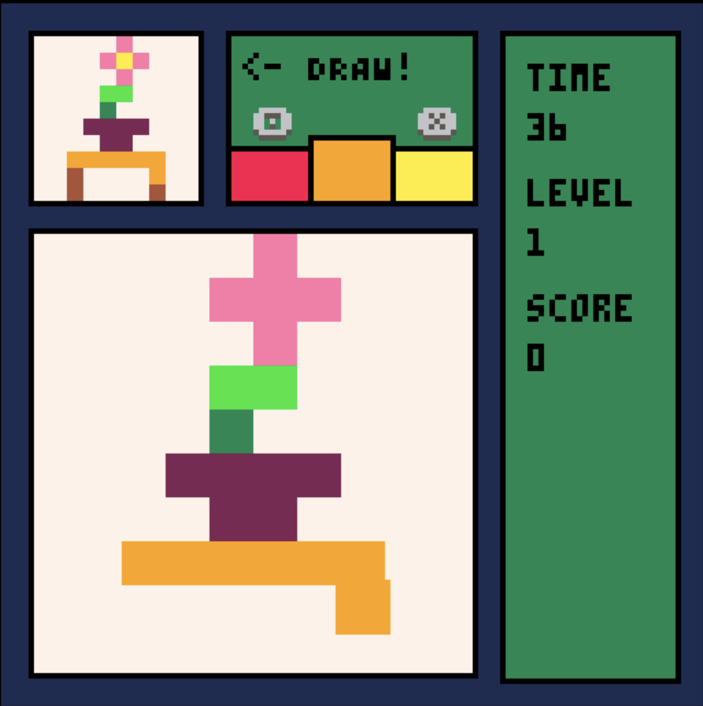
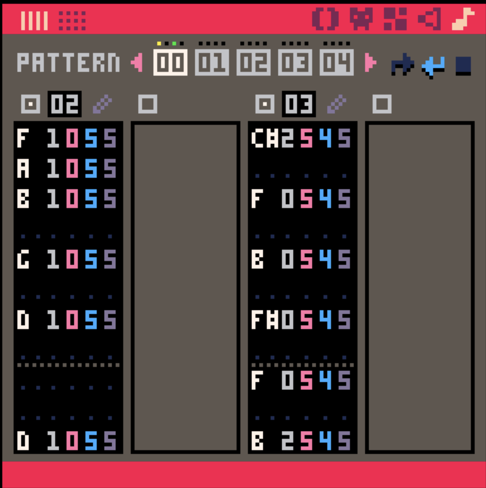
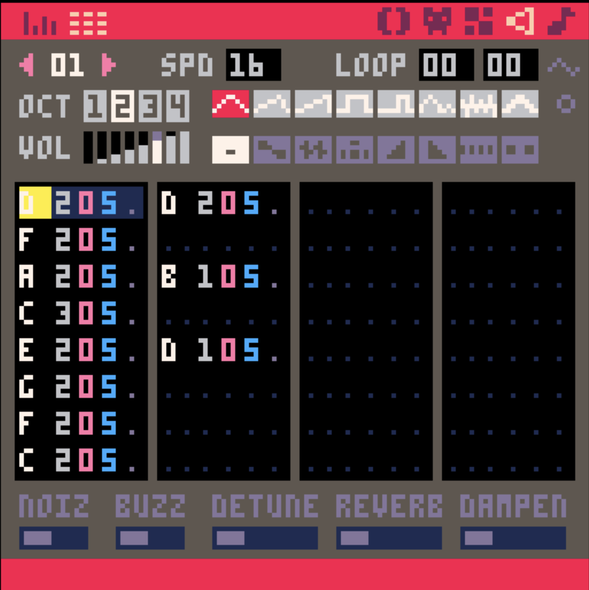

# Pixel Art Panic
My first full Pico-8 game; made for Hackclub's Siege week 6.
The theme this week was Grid.

---
## Controls
- Use the arrow keys to move the cursor around the screen.
- Use O (Z / C on keyboard) and X (X / V) to cycle through the colors.
- A color will lock if it's the correct color, so you just need to draw over a pixel with that color.
- Play on web [here](https://baton-0.itch.io/pixel-art-panic)
## Overview
- Panes -> Each pane runs independently and has a state, and the game can change the states of the panes to make the game work.
- Encoded Art -> The art is encoded strings where each color is turned into a character from 0-F, followed by how many times that color appears in a row. These are then decoded when a round starts.
    - Ex; if green appears 5 times in a row it would be B5 instead of 11,11,11,11,11
    - Ex; The shortest art string in the game is "7Q627164726U526252625R", the grayscale gradient.
## Credits
- All assets, code etc made by me. No credits this week!
---
## Devlogs
### Tuesday -> Layout, Grids, & Cursors.
- I didn't work on this on Monday - was learning Pico-8 for [Dummies](https://dummies.hackclub.com/) - but I decided to use Pico-8 since it's pretty fun.
- Came up with the idea; drawing on a grid to match a pixel art drawing as fast as you can, with combos &/ other gamemodes if I have time.
- Figured out the layout of the game screen / ratio of the hint and draw grids.
- Made the canvases for the two grids so they can display art.
- 
- Made a working cursor so you can draw on the grid, with cycling
through colors.
    - The cursor can't write colors to spots that already have the right ones.
### Wednesday -> Color Control & Game Loop
- Made the cursor be able to cycle both ways, and made the prev. and next colors show on the directions screen.
- 
- Made it so when you finish a drawing, it instantly loads a new one (might make an animation for this later...)
- After that, I worked on cleaning up some of the code and getting a bit of the menu working;
- 
### Thursday -> Menu & MVP
- Made the menu a lot cleaner than it was - went from hardcoded to each menu screen being its own table with functions for drawing and selecting options.
- Added a lose screen, finally, and the options menu, which lets you change the pane / outline / background colors.
- 
- Added transitions between screens, and changed all the panes to be state machines like the menu for that.
- Added music & SFX
- The game is done now, so I'm just going to ***polish***
### Friday - Polish & Encoding
- RE-added music & sfx, because it didn't actually save them.
- Made an encoder for and encoded all the art into strings, dropping the tokens used for the art from 111 per art to *2*.
- 
### Saturday - Submission!
- Made changes to the menu transitions, they're instant when it's just the menu.
- Made all the necessary p8 files, banners and thumbnails, etc.
- Exported to HTML for itchio!