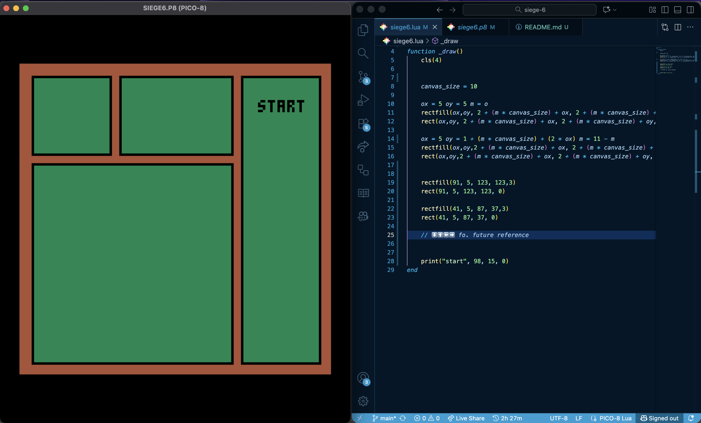
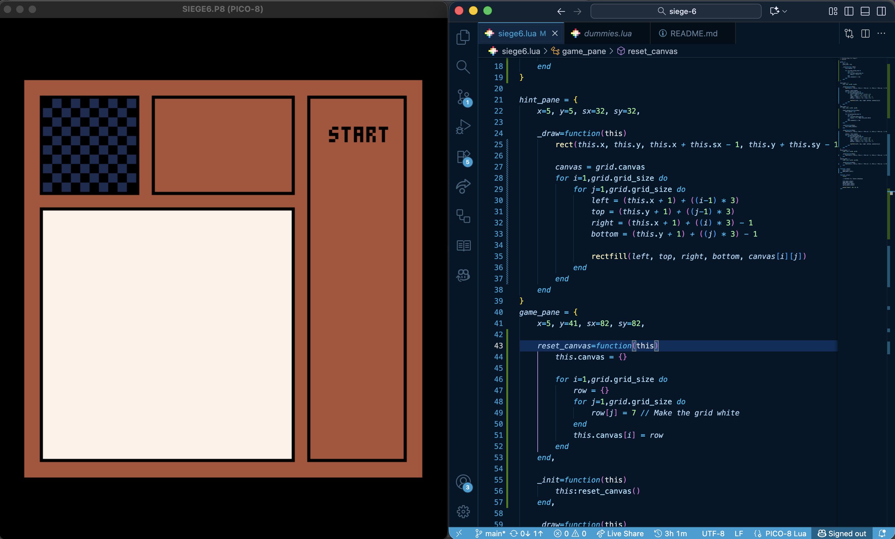
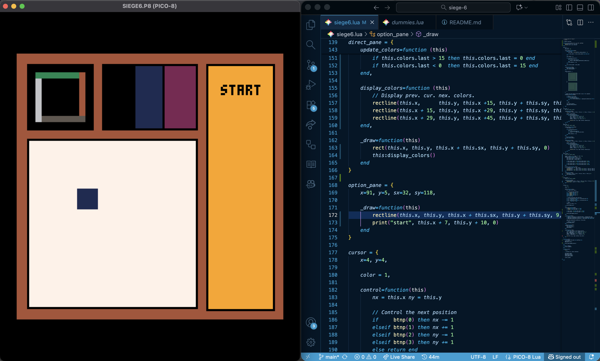
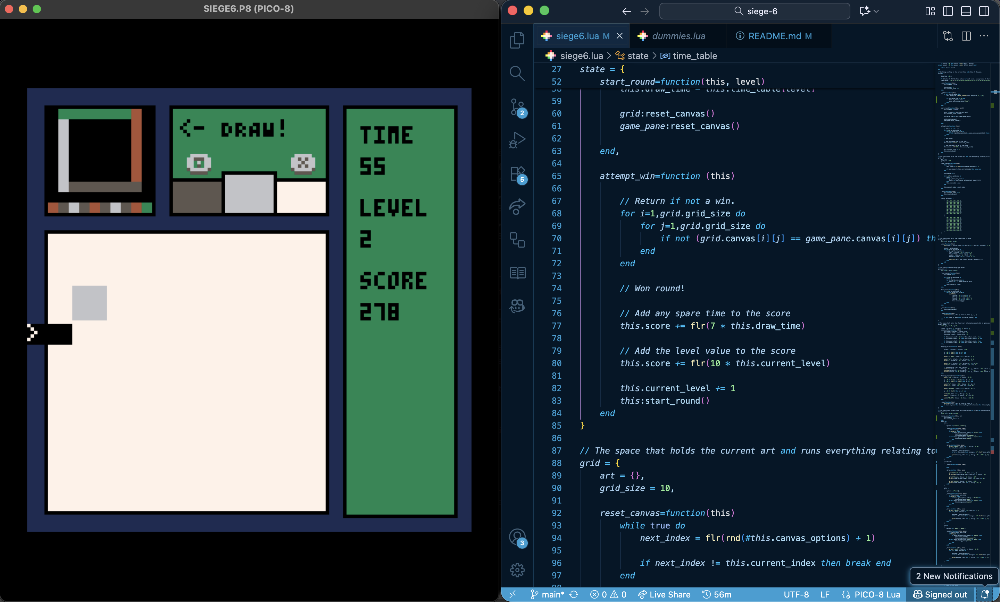
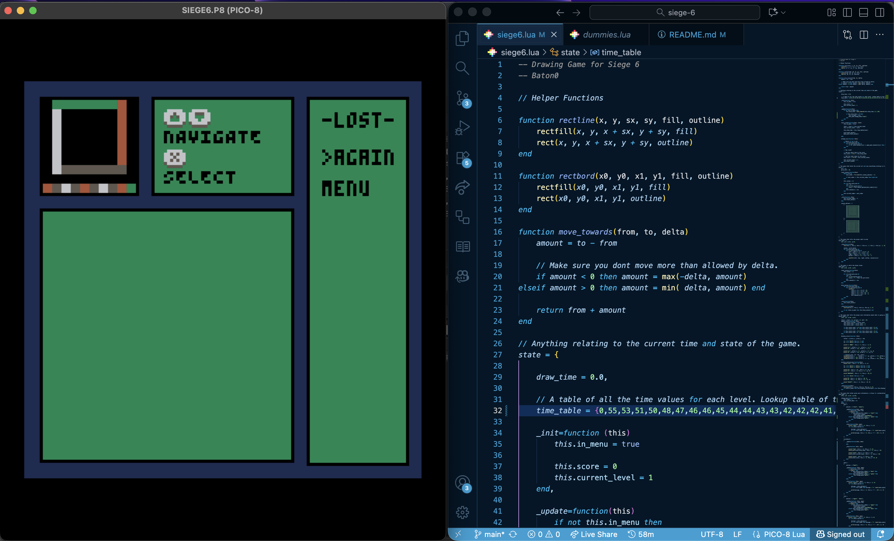
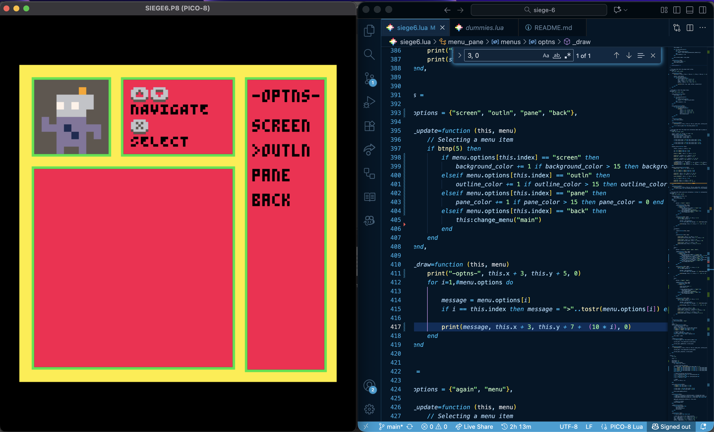

# Pixel Art Panic
My first full Pico-8 game; made for Hackclub's Siege week 6.
The theme this week was Grid.

[Gameplay image here]
---
## Controls
## Overview
## Credits
---
## Devlogs
### Tuesday
- I didn't work on this on Monday - was learning Pico-8 for [Dummies](https://dummies.hackclub.com/) - but I decided to use Pico-8 since it's pretty fun.
- Came up with the idea; drawing on a grid to match a pixel art drawing as fast as you can, with combos &/ other gamemodes if I have time.
- Figured out the layout of the game screen / ratio of the hint and draw grids.
- Made the canvases for the two grids so they can display art.
- 
- Made a working cursor so you can draw on the grid, with cycling
through colors.
    - The cursor can't write colors to spots that already have the right ones.
### Wednesday
- Made the cursor be able to cycle both ways, and made the prev. and next colors show on the directions screen.
- 
- Made it so when you finish a drawing, it instantly loads a new one (might make an animation for this later...)
- After that, I worked on cleaning up some of the code and getting a bit of the menu working;
- 
### Thursday
- Made the menu a lot cleaner than it was - went from hardcoded to each menu screen being its own table with functions for drawing and selecting options.
- Added a lose screen, finally, and the options menu, which lets you change the pane / outline / background colors.
- 